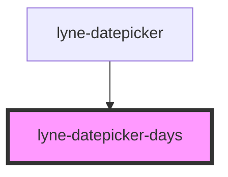

# lyne-datepicker-days

<!-- Auto Generated Below -->

## Properties

| Property                     | Attribute        | Description                                                                  | Type     | Default     |
| ---------------------------- | ---------------- | ---------------------------------------------------------------------------- | -------- | ----------- |
| `currentDay` _(required)_    | `current-day`    | The current day.                                                             | `string` | `undefined` |
| `currentMonth` _(required)_  | `current-month`  | The current month.                                                           | `string` | `undefined` |
| `selectedMonth` _(required)_ | `selected-month` | The selected month to be displayed. e.g. "8" for august or "11" for november | `string` | `undefined` |
| `selectedYear` _(required)_  | `selected-year`  | The selected year to be displayed. e.g. "1995" or "2023"                     | `string` | `undefined` |

## Dependencies

### Used by

 - [lyne-datepicker](../lyne-datepicker)

### Graph

----------------------------------------------

