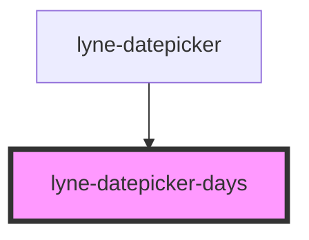

# lyne-datepicker-days

<!-- Auto Generated Below -->

## Properties

| Property                     | Attribute        | Description                                                                                                                                                                               | Type     | Default     |
| ---------------------------- | ---------------- | ----------------------------------------------------------------------------------------------------------------------------------------------------------------------------------------- | -------- | ----------- |
| `days` _(required)_          | `days`           | Stringified Array to define the written out weekdays. Format: `["Montag","Dienstag","Mittwoch", ...]` Length: the array must have the same length as the array of the property daysShort. | `string` | `undefined` |
| `daysShort` _(required)_     | `days-short`     | Stringified Array to define the short form of weekdays. Format: `["Mo","Di","Mi", ...]` Length: the array must have the same length as the array of the property days.                    | `string` | `undefined` |
| `selectedMonth` _(required)_ | `selected-month` | Set the month to be displayed. e.g. "8" for august or "11" for november                                                                                                                   | `string` | `undefined` |
| `selectedYear` _(required)_  | `selected-year`  | Set the year to be displayed. e.g. "1995" or "2023"                                                                                                                                       | `string` | `undefined` |

## Dependencies

### Used by

 - [lyne-datepicker](../lyne-datepicker)

### Graph

----------------------------------------------

