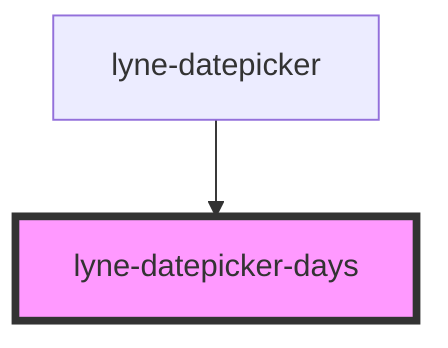

# lyne-datepicker-days

<!-- Auto Generated Below -->

## Properties

| Property                      | Attribute            | Description                                                           | Type      | Default     |
| ----------------------------- | -------------------- | --------------------------------------------------------------------- | --------- | ----------- |
| `currentDay` _(required)_     | `current-day`        | The current day.                                                      | `string`  | `undefined` |
| `currentMonth` _(required)_   | `current-month`      | The current month.                                                    | `string`  | `undefined` |
| `currentYear` _(required)_    | `current-year`       | The current year.                                                     | `string`  | `undefined` |
| `datepickerId` _(required)_   | `datepicker-id`      | The id of the datepicker.                                             | `string`  | `undefined` |
| `disablePastDates`            | `disable-past-dates` | If true the past dates are disabled.                                  | `boolean` | `false`     |
| `displayedMonth` _(required)_ | `displayed-month`    | The current displayed month. e.g. "8" for august or "11" for november | `string`  | `undefined` |
| `displayedYear` _(required)_  | `displayed-year`     | The current displayed year. e.g. "1995" or "2023"                     | `string`  | `undefined` |
| `presetTodaysDate`            | `preset-todays-date` | If true the todays date is displayed.                                 | `boolean` | `false`     |

## Dependencies

### Used by

 - [lyne-datepicker](../lyne-datepicker)

### Graph

----------------------------------------------

