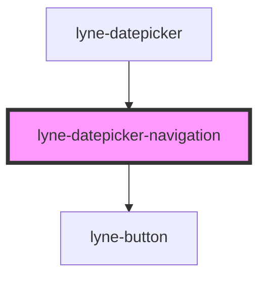

# lyne-datepicker-navigation

<!-- Auto Generated Below -->

## Properties

| Property                     | Attribute        | Description                                                     | Type     | Default     |
| ---------------------------- | ---------------- | --------------------------------------------------------------- | -------- | ----------- |
| `selectedMonth` _(required)_ | `selected-month` | Month to be displayed. e.g. "8" for august or "11" for november | `string` | `undefined` |
| `selectedYear` _(required)_  | `selected-year`  | Year to be displayed. e.g. "1995" or "2023"                     | `string` | `undefined` |

## Dependencies

### Used by

 - [lyne-datepicker](../lyne-datepicker)

### Depends on

- [lyne-button](../lyne-button)

### Graph

----------------------------------------------

