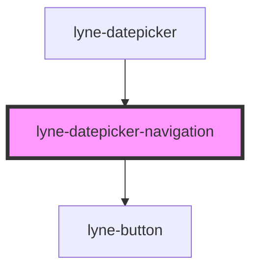

# lyne-datepicker-navigation

<!-- Auto Generated Below -->

## Properties

| Property                      | Attribute         | Description                                                           | Type     | Default     |
| ----------------------------- | ----------------- | --------------------------------------------------------------------- | -------- | ----------- |
| `displayedMonth` _(required)_ | `displayed-month` | The current displayed month. e.g. "8" for august or "11" for november | `string` | `undefined` |
| `displayedYear` _(required)_  | `displayed-year`  | The current displayed year. e.g. "1995" or "2023"                     | `string` | `undefined` |

## Dependencies

### Used by

 - [lyne-datepicker](../lyne-datepicker)

### Depends on

- [lyne-button](../lyne-button)

### Graph

----------------------------------------------

