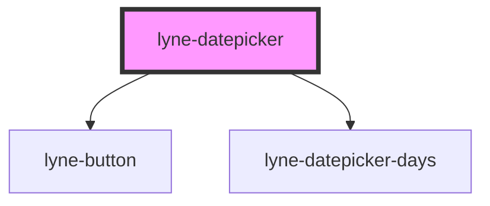

# lyne-datepicker

<!-- Auto Generated Below -->

## Properties

| Property | Attribute | Description                                                                          | Type     | Default                                                                                                                     |
| -------- | --------- | ------------------------------------------------------------------------------------ | -------- | --------------------------------------------------------------------------------------------------------------------------- |
| `months` | `months`  | Stringified Array to define the months. Format: `["Januar", "Februar", "März", ...]` | `string` | `'["Januar", "Februar", "März", "April", "Mai", "Juni", "Juli", "August", "September", "Oktober", "November", "Dezember"]'` |

## Dependencies

### Depends on

- [lyne-button](../lyne-button)
- [lyne-datepicker-days](../lyne-datepicker-days)

### Graph

----------------------------------------------

