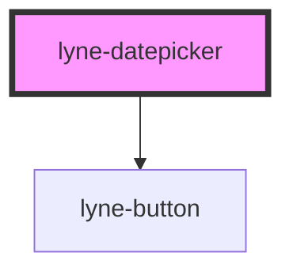

# lyne-datepicker

<!-- Auto Generated Below -->

## Properties

| Property   | Attribute   | Description                | Type               | Default     |
| ---------- | ----------- | -------------------------- | ------------------ | ----------- |
| `someProp` | `some-prop` | Documentation for someProp | `"opt1" \| "opt2"` | `undefined` |

## Slots

| Slot        | Description                  |
| ----------- | ---------------------------- |
| `"unnamed"` | Use this to document a slot. |

## Dependencies

### Depends on

- [lyne-button](../lyne-button)

### Graph

----------------------------------------------

