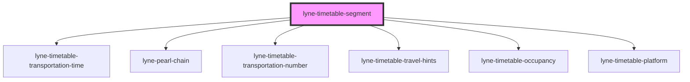

# lyne-timetable-segment

<!-- Auto Generated Below -->

## Properties

| Property              | Attribute | Description                                                                                                                               | Type     | Default     |
| --------------------- | --------- | ----------------------------------------------------------------------------------------------------------------------------------------- | -------- | ----------- |
| `config` _(required)_ | `config`  | Stringified JSON which defines most of the content of the component. Please check the individual stories to get an idea of the structure. | `string` | `undefined` |

## Dependencies

### Depends on

- [lyne-timetable-transportation-time](../lyne-timetable-transportation-time)
- [lyne-pearl-chain](../lyne-pearl-chain)
- [lyne-timetable-transportation-number](../lyne-timetable-transportation-number)
- [lyne-timetable-travel-hints](../lyne-timetable-travel-hints)
- [lyne-timetable-occupancy](../lyne-timetable-occupancy)
- [lyne-timetable-platform](../lyne-timetable-platform)

### Graph

----------------------------------------------

